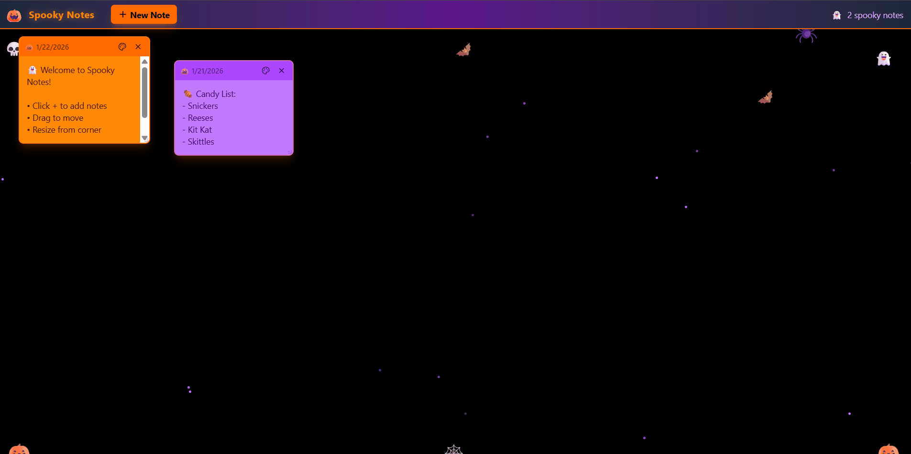

# 🎃 Spooky Sticky Notes

A Halloween-themed sticky notes app built with React and Tailwind CSS.



## Features

- ✨ Create, edit, and delete sticky notes
- 🎨 6 spooky color themes (orange, purple, lime, black, red, yellow)
- 🖱️ Drag and drop to reposition notes
- ↔️ Resize notes from the corner
- 🦇 Animated Halloween decorations (bats, spiders, pumpkins)
- ✨ Twinkling star background

## Getting Started

1. Clone the repository:
```bash
git clone https://github.com/Makellum/spooky-sticky-notes.git
cd spooky-sticky-notes
```

2. Install dependencies:
```bash
npm install
```

3. Start the development server:
```bash
npm run dev
```

4. Open http://localhost:5173 in your browser.

## Tech Stack

- React
- Vite
- Tailwind CSS
- Lucide React Icons

## License

MIT License

---

Made with 🎃 and ☕
